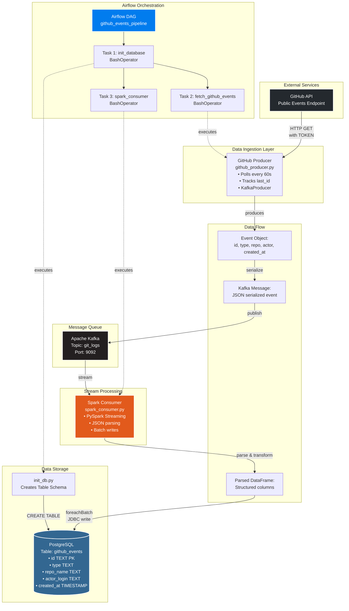

# GitHub Events Data Pipeline

This project builds a full pipeline that ingests public GitHub events and stores them in PostgreSQL through Kafka and Spark. Airflow manages workflow execution. Grafana gives you a monitoring view.

## Overview



You run these components:

* GitHub events producer script
* Kafka message broker
* Spark Structured Streaming consumer
* PostgreSQL storage
* Airflow workflow manager
* Grafana dashboard

Each service runs inside Docker.

## Pipeline Flow

* The producer script pulls events from the GitHub API.
* The script sends each new event to the git_logs topic in Kafka.
* Spark reads messages from Kafka, parses fields, converts timestamps, and writes rows into PostgreSQL.
* Airflow triggers the pipeline and controls execution order.
* Grafana connects to PostgreSQL and reads the github_events table.

## Repository Structure

* airflow

  * dags
  * logs
  * plugins
  * Dockerfile
* docker-compose.yml
* work
* .env.example
* .gitignore

## Environment Variables

You must create a .env file at the root of the project.
The .env file stays local because .gitignore blocks it from being tracked.
You define your own secure values.

Required variables:

```
POSTGRES_USER=
POSTGRES_PASSWORD=
POSTGRES_DB=

TOKEN=

AIRFLOW_FERNET_KEY=
```

Purpose:

* POSTGRES_USER, POSTGRES_PASSWORD, POSTGRES_DB set up the PostgreSQL instance.
* TOKEN holds your personal GitHub token for API requests.
* AIRFLOW_FERNET_KEY encrypts Airflow metadata.

You can copy .env.example and fill your values.

## GitHub Producer Script

The script connects to the GitHub events API.
It prints connection details and sends new events to Kafka.
It tracks the last event id to avoid duplicates.
It logs every batch:

* HTTP status
* Event count
* Sent messages
* Last processed id

## Spark Consumer

Spark reads from the git_logs topic.
It applies a schema with fields:

* id
* type
* repo_name
* actor_login
* created_at

It converts created_at into a timestamp.
It writes each microbatch into PostgreSQL through JDBC.

## Airflow Workflow

The DAG defines three tasks:

* init_database
* fetch_github_events
* spark_consumer

Execution order:

init_database runs first.
fetch_github_events and spark_consumer run after initialization.

## PostgreSQL Table

The consumer stores each event in the github_events table:

* id
* type
* repo_name
* actor_login
* created_at

## Start the Stack

Steps:

1. Create your .env file.
2. Start services:

   ```
   docker compose up -d
   ```
3. Open Airflow at [http://localhost:8080](http://localhost:8080)
4. Trigger the github_events_pipeline DAG
5. Open Grafana at [http://localhost:3000](http://localhost:3000)
6. Connect Grafana to PostgreSQL and query github_events

## Useful Commands

View logs:

```
docker compose logs -f kafka
docker compose logs -f spark
```

Stop services:

```
docker compose down
```

## Requirements

* Docker
* Docker Compose
* Valid GitHub token

---
